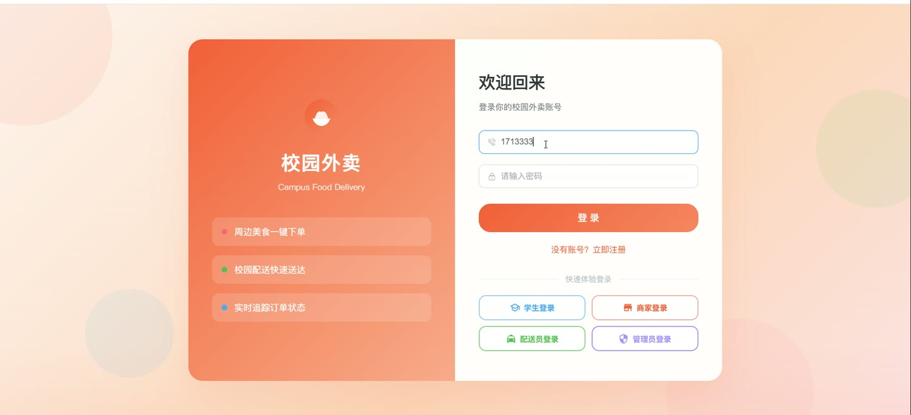
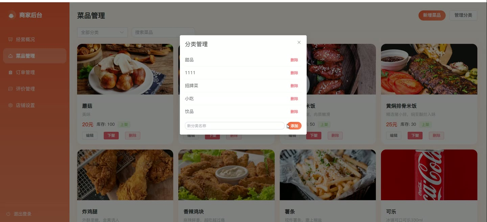

# (附文档)Springboot3+Vue3+MySQL 校园外卖系统

**技术栈**：Springboot3、Vue3、MySQL

### 系统简介

本系统是一套基于 Spring Boot 3 + Vue 3 + MySQL 构建的校园外卖配送平台，采用前后端分离架构。系统支持学生用户在线点餐、商家管理店铺与菜品、配送员接单配送、管理员全局监管，覆盖外卖业务从下单到完成的全流程。
 
### 核心功能
 
### 普通用户端

 
- 手机号+密码登录/注册，支持短信验证码校验，注册时选择普通用户或商家角色 
- 首页浏览已审核商家列表，支持按销量、评分、价格排序，并可按关键词搜索店铺 
- 查看店铺详情，包括店铺公告、菜品分类、菜品列表（含规格/口味/月销量）以及用户评价 
- 将菜品加入购物车，支持选择规格，同一菜品不同规格分开计，购物车按店铺分组展示 
- 购物车内修改数量、删除单品或清空指定店铺的全部购物车商品 
- 填写收货地址（姓名/电话/详细地址），支持设置默认地址，下单时自动带入 
- 从购物车创建订单，自动校验起送价，生成订单号，计算总价+配送费 
- 对未支付订单进行支付（模拟），支付后商家端实时收到新订单通知 
- 取消未接单的订单，查看订单列表（按状态筛选）及订单详情（含菜品明细） 
- 对已完成订单进行评价（评分+文字+图片），评价后自动更新店铺平均评分 
- 查看个人评价记录及商家回复，修改个人资料（昵称/头像/密码）
 
### 商家端

 
- 商家注册时提交店铺名称、分类、营业执照及身份证图片，提交后进入待审核状态 
- 查看店铺经营看板：今日订单数、今日营收、总订单数、平均评分、月销量 
- 查看近7天订单趋势图（每日订单量及营收变化）以及菜品销量TOP5排行 
- 管理菜品分类：新增/删除分类，分类按排序字段展示 
- 管理菜品：新增/编辑/下架/永久删除菜品，设置名称、价格、图片、描述、规格、口味、库存 
- 按分类或关键词搜索菜品，菜品列表显示月销量和上下架状态 
- 查看店铺订单列表（按状态筛选），支持接单（状态从待接单→备餐中）和标记备餐完成 
- 查看用户评价列表，对评价进行回复，回复后显示回复时间 
- 编辑店铺资料：店铺名称、Logo、Banner、公告、分类、地址、营业时间、起送价、配送费
 
### 配送员端

 
- 查看所有待配送订单（状态为备餐完成、无配送员认领），按创建时间排序 
- 抢单接单：点击“抢单”后订单状态变为配送中，并绑定当前配送员 
- 查看自己已接的配送订单列表，支持按状态筛选（配送中/已完成） 
- 完成配送：点击“完成送达”后订单状态变为已完成，同时更新商家月销量和菜品月销量 
- 查看个人配送统计：总订单数、今日订单数、总配送费收入、今日收入、月度订单数及收入 
- 查看累计配送里程（模拟计算）及近7天每日配送订单量和收入趋势 
- 查看最近20条配送收入明细（订单编号、配送费、完成时间、店铺名、地址、距离）
 
### 管理员端

 
- 查看全局数据看板：今日订单数、今日营收、总订单数、总营收、用户总数、已审核商家数 
- 查看近7天全平台订单趋势图以及商家月销量排行榜TOP5 
- 查看订单状态分布统计（待支付/待接单/备餐中/待取餐/配送中/已完成/已取消） 
- 管理商家入驻审核：查看待审核/已通过/未通过商家列表，执行审核通过或驳回操作 
- 删除违规商家，管理配送区域：新增/编辑/删除配送区域（名称、描述、配送费、预计送达时间） 
- 管理用户：按角色（普通用户/商家/配送员）筛选用户列表，修改用户昵称、角色、启用/禁用状态 
- 删除用户，查看全平台订单列表（按状态筛选），手动修改订单状态或删除订单
 
### 技术栈

 后端框架Spring Boot 3.x ORMMyBatis-Plus（自动填充、分页插件） 权限认证JWT（自定义拦截器+角色校验） 前端框架Vue 3（Composition API） 状态管理Vue Router（路由守卫） 构建工具Vite 数据库MySQL 8.x 实时通信WebSocket（STOMP + SockJS） 文件上传Spring MultipartFile + 本地存储 密码加密自定义 PasswordUtil
 
### 交付内容

 
- 后端完整源码 
- 前端完整源码 
- 数据库初始化脚本 
- 万字文档

## 界面展示

---

## 获取完整源码 + 万字文档

本仓库为项目介绍页。**完整前后端源码、数据库初始化脚本、万字项目文档**，请加微信 `kangkangcode`，或访问 [codekk.top](http://codekk.top) 获取。

可作课程设计 / 毕业设计参考，支持远程部署调试。